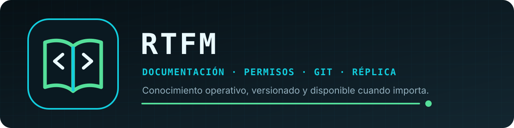

<p align="center">
  
</p>

<p align="center">
  <a href="https://github.com/Ezr43l/rtfm-s/actions/workflows/ci.yml"></a>
  
  
  
  <a href="LICENSE"></a>
</p>

<p align="center"><strong>El conocimiento operativo también necesita alta disponibilidad.</strong></p>

RTFM (Read The Fucking Manual) es una aplicación autohospedada para organizar
documentación técnica, procedimientos, diagramas y conocimiento operativo. Cada
instancia incluye WebUI, API, almacenamiento documental, auditoría, historial Git
y réplica en un único contenedor Linux.

La única versión publicada en este repositorio es `0.4.9`. Su árbol se exportó
sin el historial ni los datos del entorno de desarrollo.

La serie `0.x` sigue siendo experimental. No expongas RTFM fuera de una red de
confianza sin HTTPS y una revisión específica del despliegue.

**[Instalación en Unraid](docs/UNRAID-INSTALLATION.md)** ·
**[Arquitectura](docs/ARCHITECTURE.md)** ·
**[API](docs/API-CONTRACT.md)** ·
**[Modelo de seguridad](docs/SECURITY-MODEL.md)**

## Instalación en Unraid

La plantilla `unraid/my-RTFM.xml` sólo solicita:

1. el puerto de la WebUI y API, normalmente `7400`;
2. el directorio persistente, normalmente `/mnt/user/appdata/rtfm/data`.

RTFM usa red `host` porque el modo automático debe observar la IP flotante real
del servidor. La plantilla descarga `ghcr.io/ezr43l/rtfm-s:0.4.9`; no construye
la imagen ni depende del Registry local.

Tras crear el contenedor abre la WebUI. El asistente inicial pide los datos de
la instancia, la cuenta propietaria, Keepalived, réplicas, seguridad, políticas
y Git. La configuración y los secretos generados quedan bajo `/data/.rtfm`, no
en la plantilla ni en `docker inspect`.

Después del alta, una cuenta con control total puede modificar esos valores en
**Ajustes → Configuración**. El token de Keepalived nunca vuelve a mostrarse:
dejarlo vacío lo conserva y vaciar también la URL desactiva la integración.

En la vista de lectura de cualquier documento, **Exportar PDF** espera a que las
imágenes y los diagramas terminen de renderizarse y abre el diálogo de impresión
del navegador. Elige **Guardar como PDF** para obtener una copia A4 limpia, sin
la navegación ni los controles del portal.

La guía operativa está en `docs/UNRAID-INSTALLATION.md`.

## Instalación con Docker Compose

```bash
cp .env.example .env
docker compose up --build -d
```

Abre `http://servidor:7400` y completa el mismo asistente. Compose construye
desde el código y por eso sirve también antes de que exista una imagen pública.

## Modos de funcionamiento

- Un servidor: elige `active`, sin Keepalived ni pares.
- Alta disponibilidad: elige `auto`, configura Keepalived y declara los otros
  nodos. Sólo el servidor que posee la VIP acepta escrituras.
- `passive` y `unknown` son modos de diagnóstico o bloqueo controlado.

Si RTFM no puede demostrar qué nodo es activo, bloquea las mutaciones.

## Alta disponibilidad y código de incorporación

Configura primero el nodo que iniciará el conjunto sin código de incorporación.
La app crea una cuenta propietaria y genera:

- un secreto de sesiones y cifrado de cuentas;
- un token de réplica;
- un identificador idempotente para la reclamación de Keepalived.

La WebUI muestra una sola vez un código que contiene esos valores compartidos.
Guárdalo temporalmente como una credencial. Al instalar otro nodo, pega el código
en su asistente; el servicio y la reclamación de Keepalived, las sesiones y la
réplica quedan alineados. El token de la API local de Keepalived se pide por
separado en cada nodo y se guarda cifrado por los permisos del volumen, nunca en
Docker.

Un nodo incorporado no crea una segunda cuenta propietaria. Usuarios, permisos y
contenido llegan desde el nodo activo mediante la réplica.

El conector realiza una reclamación idempotente contra `POST /api/claims` y
comprueba que Keepalived devuelve el mismo servicio. Una parada individual no
libera la reclamación compartida.

## Persistencia

El único volumen `/data` contiene:

- Markdown, metadatos, imágenes, vault y tombstones;
- cuentas, permisos y auditoría;
- proyección Git;
- configuración local, secretos y certificados privados bajo `.rtfm`.

Un backup coherente debe incluir el volumen completo. Al restaurar una réplica,
conserva también `.rtfm`; restaurar sólo los documentos rompe las credenciales y
la identidad del nodo.

La imagen se ejecuta como UID/GID `10001:10001`. Un bind mount del host debe
permitir escritura a ese usuario. `scripts/migrate-data-uid.sh` conserva el flujo
transaccional de migración y rollback para volúmenes antiguos.

## Acceso y permisos

La primera instalación crea una cuenta personal con control total. Las
contraseñas usan `scrypt`, TOTP se cifra con una clave derivada del secreto de
sesión, las cookies son `HttpOnly` y `SameSite=Strict`, y las mutaciones web
exigen CSRF.

Cada persona o cliente API tiene un rol global (`reader`, `operator` o
`full_control`). Una biblioteca puede ser abierta o limitarse mediante permisos
individuales. Un permiso local nunca eleva el rol global.

Los documentos son contenido versionable. Cada operación conserva actor, fecha
UTC, nodo, identificador, revisión y resultado. Archivar y eliminar son estados
distintos; una eliminación crea vault y tombstone.

## Compatibilidad con instalaciones existentes

El runtime mantiene las variables históricas y los secretos directos o `*_FILE`
para actualizar instalaciones anteriores sin cambiar su comportamiento. Cuando
se proporcionan explícitamente, tienen prioridad y el asistente inicial no se
activa. Los artefactos públicos nuevos no incluyen esos campos.

Al migrar desde el antiguo nombre “Base Documental”, detén primero aquel
contenedor y monta exactamente su mismo directorio en `/data`. No ejecutes ambos
nombres a la vez sobre el mismo volumen ni el mismo puerto.

## API y estado

La API principal usa `/api/v1`. Antes del login están disponibles:

```text
GET  /api/v1/setup
POST /api/v1/setup
GET  /api/v1/public-status
GET  /api/health
GET  /api/version
```

El resto ofrece sesiones, usuarios, clientes API, bibliotecas, categorías,
documentos, imágenes, favoritos, búsquedas, registros y réplica. La salud
distingue `ok`, `degraded`, `unknown` y `setup_required`.

## Construcción y verificación

```bash
./build-image.sh
```

El build ejecuta pruebas Python, typecheck y build de producción antes de crear
la imagen. Las pruebas de runtime usan contenedores y volúmenes etiquetados y los
eliminan de forma exacta al terminar.

La publicación multi-arquitectura sólo se realiza tras aprobar la release:

```bash
PUBLISH=true IMAGE_REPOSITORY=ghcr.io/ezr43l/rtfm-s ./build-image.sh
```

`linux/amd64` corresponde a los servidores Unraid/x86-64 habituales y
`linux/arm64` a hosts ARM; no son builds de Windows.

## Licencia

RTFM se distribuye bajo Apache License 2.0. Los componentes de terceros y sus
licencias se detallan en `THIRD_PARTY_NOTICES.md`.
